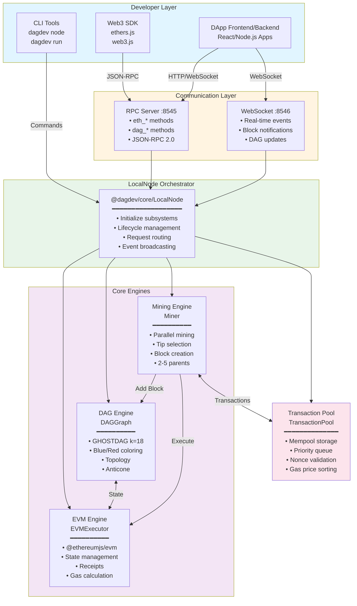
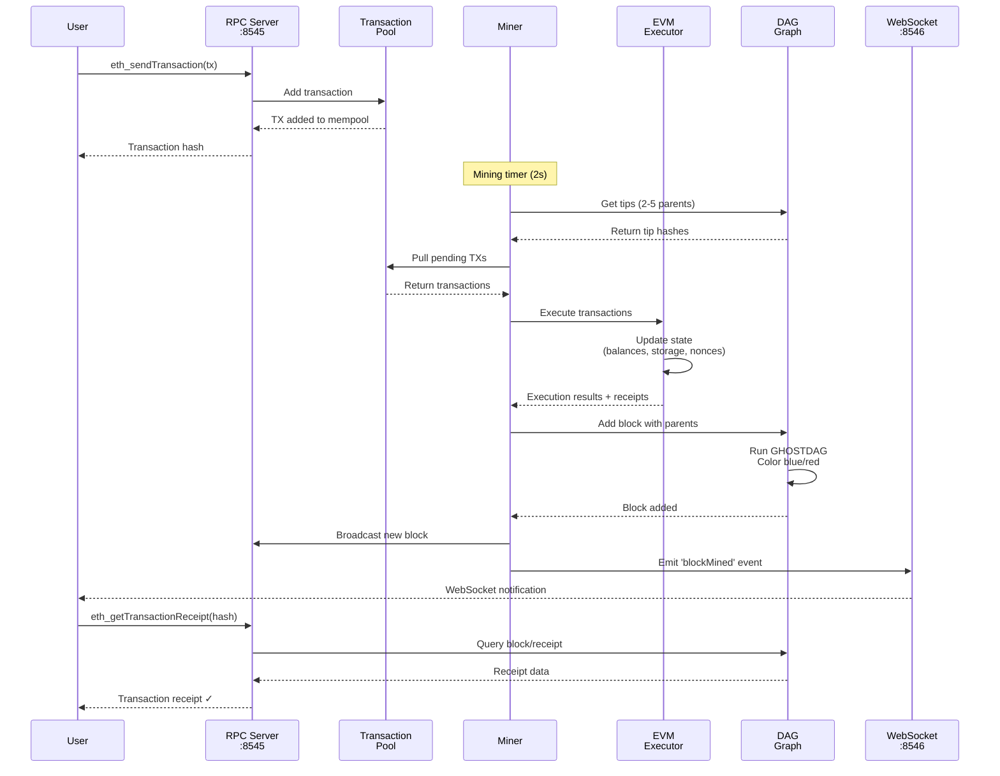
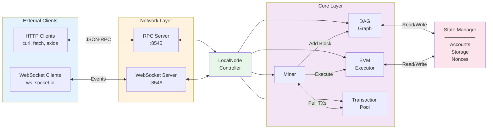

# DagDev Local Node Architecture

## How DagDev Simulates BlockDAG Consensus

DagDev's local node provides a complete BlockDAG simulation environment that mimics the behavior of the BlockDAG mainnet/testnet, allowing developers to test DAG-specific features locally without network connectivity.

## High-Level Architecture

### System Overview



### Data Flow Architecture



### Component Interaction Map



### Layer Architecture

```
┌──────────────────────────────────────────────────────────────────┐
│  Layer 4: External Interface                                      │
│  • CLI Commands (dagdev node, run, compile)                       │
│  • JSON-RPC API (Ethereum compatible)                             │
│  • WebSocket API (Real-time events)                               │
└────────────────────────────┬─────────────────────────────────────┘
                             │
┌────────────────────────────▼─────────────────────────────────────┐
│  Layer 3: Network Services                                        │
│  • RPCServer: HTTP endpoint, request routing                      │
│  • WebSocketServer: Subscription management, broadcasting         │
└────────────────────────────┬─────────────────────────────────────┘
                             │
┌────────────────────────────▼─────────────────────────────────────┐
│  Layer 2: Business Logic (LocalNode)                              │
│  • Transaction lifecycle management                               │
│  • Block propagation coordination                                 │
│  • Service orchestration                                          │
│  • Event emission and aggregation                                 │
└────────────────────────────┬─────────────────────────────────────┘
                             │
┌────────────────────────────▼─────────────────────────────────────┐
│  Layer 1: Core Engines                                            │
│  • DAGGraph: Consensus, ordering, blue/red coloring               │
│  • EVMExecutor: Smart contract execution, state transitions       │
│  • Miner: Block production, tip selection, parallelism            │
│  • TransactionPool: Mempool, validation, priority queue           │
└────────────────────────────┬─────────────────────────────────────┘
                             │
┌────────────────────────────▼─────────────────────────────────────┐
│  Layer 0: Data Storage                                            │
│  • In-memory DAG graph (blocks, edges, metadata)                  │
│  • Merkle Patricia Trie (account/storage state)                   │
│  • Transaction pool (pending transactions)                        │
│  • Block index (hash → block mapping)                             │
└──────────────────────────────────────────────────────────────────┘
```

## Core Components

### 1. **DAGGraph** - The DAG Structure
- **GHOSTDAG Algorithm**: Implements the k-cluster consensus with configurable `k` parameter (default: k=18)
- **Parallel Block Mining**: Multiple blocks can be mined simultaneously and reference multiple parent blocks
- **Blue/Red Coloring**: Blocks are colored based on the PHANTOM algorithm:
  - **Blue blocks**: Well-connected blocks in the honest chain
  - **Red blocks**: Potentially adversarial or poorly connected blocks
- **Topological Ordering**: Maintains a linear order of blocks for transaction execution

### 2. **Miner** - Block Production
Simulates real-world mining behavior:
```typescript
{
  blockTime: 2000ms,        // Mine blocks every 2 seconds
  parallelism: 3,           // Can mine up to 3 blocks simultaneously
  difficulty: 1000,         // Simulated proof-of-work difficulty
  tipSelectionStrategy: 'phantom' // Use PHANTOM for parent selection
}
```

**Mining Process:**
1. Selects multiple tips from the DAG as parents (typically 2-5 parents)
2. Creates a new block referencing all selected parents
3. Adds pending transactions from the transaction pool
4. Executes transactions via EVM and updates state
5. Broadcasts block to RPC/WebSocket clients

### 3. **Transaction Pool** - Mempool Management
- Stores pending transactions before they're included in blocks
- Prioritizes transactions by gas price and nonce
- Validates transactions against current EVM state
- Maximum pool size: 1000 transactions (configurable)

### 4. **EVM Executor** - Smart Contract Runtime
- **Full Ethereum Compatibility**: Uses `@ethereumjs/evm` for 100% EVM compliance
- **State Management**: Merkle Patricia Trie for account and storage state
- **Transaction Execution**: Processes contract deployments, calls, and value transfers
- **Receipt Generation**: Creates transaction receipts with logs and status

### 5. **RPC Server** - JSON-RPC 2.0 Interface
Provides both standard Ethereum and DAG-specific methods:

**Standard Ethereum Methods:**
```javascript
eth_blockNumber()         // Latest block number
eth_getBalance(address)   // Account balance
eth_sendTransaction(tx)   // Submit transaction
eth_call(tx)             // Execute read-only call
eth_getTransactionReceipt(hash) // Get tx receipt
eth_getCode(address)     // Get contract bytecode
```

**DAG-Specific Methods:**
```javascript
dag_getDAGInfo()         // DAG statistics (k, tips, blue score)
dag_getTips()            // Current DAG tips
dag_getBlueSet()         // Blue blocks in consensus
dag_getRedSet()          // Red blocks (conflicts)
dag_getBlockParents(hash) // All parent blocks
dag_getAnticone(hash)    // Blocks not in past/future
dag_mineBlocks(n)        // Force mine N blocks
```

### 6. **WebSocket Server** - Real-Time Events
Broadcasts live updates:
```javascript
// Subscribe to events
ws.send({ method: 'subscribe', params: ['newBlocks'] })

// Receive events
{
  event: 'blockMined',
  data: {
    hash: '0x...',
    number: 123,
    parents: ['0x...', '0x...'],
    color: 'blue',
    transactions: [...]
  }
}
```

## BlockDAG Simulation Flow

### Block Mining Cycle
```
1. Timer triggers (every 2 seconds by default)
   ↓
2. Miner selects 2-5 tips as parents
   ↓
3. Creates block header with parent references
   ↓
4. Pulls transactions from pool
   ↓
5. Executes transactions via EVM
   ↓
6. Updates state (accounts, storage, nonces)
   ↓
7. Calculates blue/red coloring using GHOSTDAG
   ↓
8. Adds block to DAG
   ↓
9. Broadcasts to RPC/WebSocket clients
   ↓
10. Emits 'blockMined' event
```

### Transaction Execution
```
1. User submits transaction via eth_sendTransaction
   ↓
2. Transaction added to pool
   ↓
3. Waits for next block mining cycle
   ↓
4. Transaction included in new block
   ↓
5. EVM executes transaction (may create contract)
   ↓
6. State updated (balances, storage, code)
   ↓
7. Receipt generated with logs and status
   ↓
8. User polls eth_getTransactionReceipt for confirmation
```

### Blue Set Confirmation
Unlike linear blockchains, BlockDAG requires **blue set confirmation**:

```
Transaction Confirmation Levels:
- In Mempool: Not yet in a block
- In DAG: Included in a block (could be red)
- In Blue Set: Block colored blue (consensus accepted)
- Deep Blue: 6+ blue blocks built on top (finalized)
```

The local node simulates this by:
1. Immediately adding blocks to the DAG
2. Running GHOSTDAG to color blocks blue/red
3. Only executing transactions in blue blocks
4. Maintaining a blue chain for transaction ordering

## Key Differences from Linear Chains

| Feature | Linear Blockchain | BlockDAG (DagDev) |
|---------|------------------|-------------------|
| Block Parents | 1 parent | 2-5 parents (configurable) |
| Orphan Blocks | Discarded | Included as red blocks |
| Confirmation | Block depth | Blue set membership |
| Throughput | ~1 block/10s | 3 blocks/2s (150x faster) |
| Reorganization | Chain reorg | Blue/red recoloring |
| Transaction Order | Block order | Topological + PHANTOM order |

## Network Binding

**v1.0.5+ Enhancement:**
- RPC server binds to `0.0.0.0:8545` (all interfaces)
- WebSocket binds to `0.0.0.0:8546` (all interfaces)
- Accepts connections from localhost, LAN, or Docker containers
- Cross-platform compatible (Windows, Linux, macOS, WSL)

## Configuration

Customize the local node via `dagdev.config.js`:

```javascript
module.exports = {
  networks: {
    local: {
      url: 'http://127.0.0.1:8545',
      chainId: 1337,
      
      // DAG-specific settings
      dagConfig: {
        k: 18,              // GHOSTDAG k-cluster size
        blockTime: 2000,    // 2 seconds between blocks
        parallelism: 3,     // 3 blocks can mine simultaneously
        difficulty: 1000    // Simulated PoW difficulty
      }
    }
  }
}
```

## Use Cases

### 1. **Rapid Development**
- No network latency (instant feedback)
- Fast block times (2s vs 10s on testnet)
- Complete control over mining

### 2. **DAG Testing**
- Test parallel transaction processing
- Verify blue/red block handling
- Simulate network partitions and conflicts

### 3. **Contract Testing**
- Deploy and test contracts locally
- Debug with instant block confirmation
- Test complex multi-block scenarios

### 4. **Integration Testing**
- Test full DApp workflows
- Verify WebSocket event handling
- Simulate high-throughput scenarios

## Technical Stack

```
┌─────────────────────────────────────┐
│   DagDev CLI (dagdev node)         │
└──────────────┬──────────────────────┘
               │
┌──────────────▼──────────────────────┐
│   LocalNode (@dagdev/core)         │
│   - Orchestrates all components    │
└──────────────┬──────────────────────┘
               │
    ┌──────────┼──────────┐
    │          │          │
┌───▼───┐  ┌──▼───┐  ┌──▼────┐
│ DAG   │  │ EVM  │  │ Miner │
│ Graph │  │ Exec │  │       │
└───┬───┘  └──┬───┘  └───┬───┘
    │         │          │
    └─────────┼──────────┘
              │
    ┌─────────┼─────────┐
    │                   │
┌───▼────┐      ┌──────▼──────┐
│  RPC   │      │  WebSocket  │
│ :8545  │      │   :8546     │
└────────┘      └─────────────┘
```

## Summary

DagDev's local node provides a **complete, high-fidelity simulation** of BlockDAG consensus:

✅ **Parallel block mining** with multiple parents  
✅ **GHOSTDAG consensus** with blue/red coloring  
✅ **Full EVM compatibility** for smart contracts  
✅ **Real-time DAG updates** via WebSocket  
✅ **Ethereum-compatible RPC** for seamless integration  
✅ **DAG-specific methods** for advanced testing  

This allows developers to build and test BlockDAG-native applications locally before deploying to the live network, with full confidence that the behavior will be identical.
